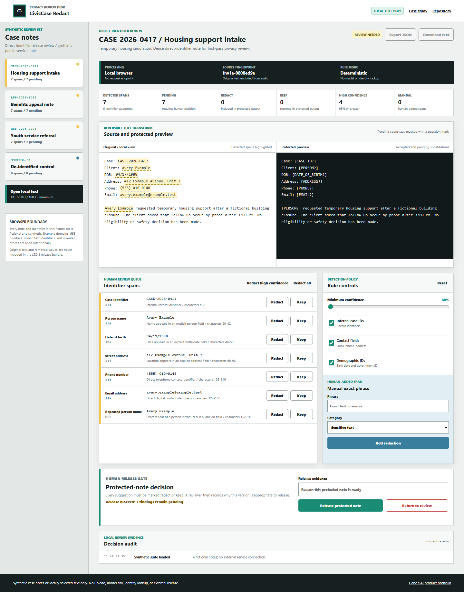
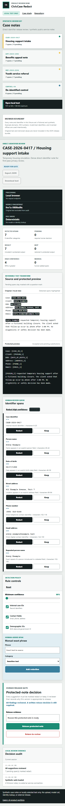

# Gabe - AI Digital Product Developer Portfolio

This portfolio features ten complete, local-first AI digital products spanning workflow design, formal evaluation, event reliability, browser media processing, telemetry monitoring, privacy-preserving text processing, and human review.

## Overview

I design practical AI products that turn complex business workflows into clear, interactive tools. Every project is public, runnable, documented, and built around an explicit user decision.

The demos use synthetic data and deterministic browser logic. They are product prototypes rather than production systems.

## Featured Products

| Project | Business Problem | AI Capability | Demo |
| --- | --- | --- | --- |
| SignalOps Triage | Field-service teams need consistent incident triage and dispatch recommendations. | Classification, severity scoring, repeated-failure detection, human approval. | [Suite demo](https://jubjub-cpu.github.io/gabe-ai-product-portfolio/projects/signalops-triage/) / [Standalone](https://jubjub-cpu.github.io/signalops-triage/) |
| ReviewFlow Agent | Procurement teams need consistent, approval-sensitive handling for vendor exceptions. | Structured extraction, classification, policy checks, staged planning, two human gates, decision history. | [Suite demo](https://jubjub-cpu.github.io/gabe-ai-product-portfolio/projects/reviewflow-agent/) / [Standalone](https://jubjub-cpu.github.io/reviewflow-agent/) |
| DocuTrace Desk | Reviewers need document answers with source evidence. | Retrieval, structured extraction, citations, version comparison, human verification. | [Suite demo](https://jubjub-cpu.github.io/gabe-ai-product-portfolio/projects/doctrace-desk/) / [Standalone](https://jubjub-cpu.github.io/doctrace-desk/) |
| FrameForge Inspect | Creative teams need a repeatable first pass for still-image delivery defects. | Actual Canvas pixel metrics, clipping and contrast checks, regional overlays, baseline comparison, human delivery gate. | [Archived suite concept](https://jubjub-cpu.github.io/gabe-ai-product-portfolio/projects/frameforge-qa/) / [Standalone](https://jubjub-cpu.github.io/frameforge-inspect/) |
| QueueCast Planner | Service teams need visible demand uncertainty and capacity tradeoffs before staffing decisions. | Explainable trend, uncertainty band, five-assumption simulation, weekly risk, staffing brief, human planning gate. | [Archived PilotMap concept](https://jubjub-cpu.github.io/gabe-ai-product-portfolio/projects/pilotmap-ai/) / [Standalone](https://jubjub-cpu.github.io/queuecast-planner/) |
| EvalDeck Studio | AI product teams need repeatable evidence before prompt or model changes ship. | Four pairwise rubrics, slice regressions, reference disagreement, configurable gates, reasoned overrides, JSONL/JSON/CSV artifacts. | [Standalone](https://jubjub-cpu.github.io/evaldeck-studio/) |
| FlowReplay Console | Integration teams need to distinguish contract drift, transient failures, duplicates, and dead-letter recovery before replaying webhooks. | Versioned contracts, response classification, retry backoff, failure injection, idempotent no-ops, reasoned replay approval, JSON evidence. | [Standalone](https://jubjub-cpu.github.io/flowreplay-console/) |
| VoiceGauge Local | Audio teams need a private first pass for clipping, level, silence, and background signal. | Real Web Audio decoding, six PCM metrics, timed Canvas findings, baseline comparison, local upload, threshold policy, human handoff gate. | [Standalone](https://jubjub-cpu.github.io/voicegauge-local/) |
| ColdChain Sentinel | Cold-chain operators need to distinguish persistent excursions from noisy spikes and unhealthy sensor evidence. | Multivariate telemetry, persistence, clear hysteresis, spike suppression, sensor-gap detection, policy tuning, and a human incident gate. | [Standalone](https://jubjub-cpu.github.io/coldchain-sentinel/) |
| CivicCase Redact | Case-note reviewers need reversible direct-identifier review before protected text is released. | Seven identifier types, exact offsets, repeated-name context, reversible decisions, manual redaction, value-free manifest, and a human release gate. | [Standalone](https://jubjub-cpu.github.io/civiccase-redact/) |

## Business Problem

Many teams are interested in AI but struggle to translate messy workflows into useful, reviewable products. This portfolio focuses on concrete decisions, visible evidence, and interfaces that make complex work easier to understand.

## Target Users

The products are designed for operations coordinators, AI quality teams, integration developers, document reviewers, workforce planners, creators, media producers, logistics teams, privacy reviewers, and hiring managers reviewing practical AI product potential.

## Product Approach

Each demo uses deterministic browser logic to model decision support. This keeps the experience free, safe, and repeatable while showing where automation adds value and where a human remains in control.

## Main Features

- Ten released product demos with synthetic data.
- Central portfolio page with project cards and capability matrix.
- Human-in-the-loop review points in every product.
- Product documentation, case studies, validation evidence, and release history.
- Validation script for structure, privacy markers, and required files.

## Product Walkthrough

Open `index.html` in a browser, then choose any product from the top navigation or project grid. Each product has a complete primary workflow:

1. Select or enter a synthetic input.
2. Run the product analysis.
3. Review the recommendation, draft, citation, revision, or score.
4. Approve, reject, or inspect the supporting evidence.

## Screenshots

Current screenshots captured from the implemented local app:







## Live Demo

Live portfolio:

[https://jubjub-cpu.github.io/gabe-ai-product-portfolio/](https://jubjub-cpu.github.io/gabe-ai-product-portfolio/)

Repository:

[https://github.com/jubjub-cpu/gabe-ai-product-portfolio](https://github.com/jubjub-cpu/gabe-ai-product-portfolio)

GitHub profile:

[https://github.com/jubjub-cpu](https://github.com/jubjub-cpu)

Release:

[v2.0.1 - Accessibility and release hardening](https://github.com/jubjub-cpu/gabe-ai-product-portfolio/releases/tag/v2.0.1)

Standalone SignalOps:

- [Live demo](https://jubjub-cpu.github.io/signalops-triage/)
- [Repository](https://github.com/jubjub-cpu/signalops-triage)
- [v1.0.1 release](https://github.com/jubjub-cpu/signalops-triage/releases/tag/v1.0.1)

Standalone DocuTrace:

- [Live demo](https://jubjub-cpu.github.io/doctrace-desk/)
- [Repository](https://github.com/jubjub-cpu/doctrace-desk)
- [v1.0.0 release](https://github.com/jubjub-cpu/doctrace-desk/releases/tag/v1.0.0)

Standalone ReviewFlow:

- [Live demo](https://jubjub-cpu.github.io/reviewflow-agent/)
- [Repository](https://github.com/jubjub-cpu/reviewflow-agent)
- [v1.0.1 release](https://github.com/jubjub-cpu/reviewflow-agent/releases/tag/v1.0.1)

Standalone FrameForge Inspect:

- [Live demo](https://jubjub-cpu.github.io/frameforge-inspect/)
- [Repository](https://github.com/jubjub-cpu/frameforge-inspect)
- [v1.0.0 release](https://github.com/jubjub-cpu/frameforge-inspect/releases/tag/v1.0.0)

Standalone QueueCast Planner:

- [Live demo](https://jubjub-cpu.github.io/queuecast-planner/)
- [Repository](https://github.com/jubjub-cpu/queuecast-planner)
- [v1.0.1 release](https://github.com/jubjub-cpu/queuecast-planner/releases/tag/v1.0.1)

Standalone EvalDeck Studio:

- [Live demo](https://jubjub-cpu.github.io/evaldeck-studio/)
- [Repository](https://github.com/jubjub-cpu/evaldeck-studio)
- [v1.0.1 release](https://github.com/jubjub-cpu/evaldeck-studio/releases/tag/v1.0.1)

Standalone FlowReplay Console:

- [Live demo](https://jubjub-cpu.github.io/flowreplay-console/)
- [Repository](https://github.com/jubjub-cpu/flowreplay-console)
- [v1.0.1 release](https://github.com/jubjub-cpu/flowreplay-console/releases/tag/v1.0.1)

Standalone VoiceGauge Local:

- [Live demo](https://jubjub-cpu.github.io/voicegauge-local/)
- [Repository](https://github.com/jubjub-cpu/voicegauge-local)
- [v1.0.1 release](https://github.com/jubjub-cpu/voicegauge-local/releases/tag/v1.0.1)

Standalone ColdChain Sentinel:

- [Live demo](https://jubjub-cpu.github.io/coldchain-sentinel/)
- [Repository](https://github.com/jubjub-cpu/coldchain-sentinel)
- [v1.0.1 release](https://github.com/jubjub-cpu/coldchain-sentinel/releases/tag/v1.0.1)

Standalone CivicCase Redact:

- [Live demo](https://jubjub-cpu.github.io/civiccase-redact/)
- [Repository](https://github.com/jubjub-cpu/civiccase-redact)
- [v1.0.1 release](https://github.com/jubjub-cpu/civiccase-redact/releases/tag/v1.0.1)

Local fallback:

Open `index.html` directly in a browser.

## AI Capability

The demos show AI product patterns without pretending a paid model is running:

- Classification and severity scoring.
- Agent-style planning and review queues.
- Document retrieval and citations.
- Creative media QA and handoff drafting.
- Responsible AI opportunity scoring.
- Formal AI-output evaluation, regression analysis, and release gating.
- API contracts, event retries, idempotency, failure injection, and dead-letter recovery.
- Web Audio decoding, PCM signal analysis, waveform overlays, and local audio privacy.
- Multivariate telemetry monitoring, persistence-aware anomaly detection, clear hysteresis, and sensor-health evidence.
- Offset-preserving direct-identifier detection, reversible privacy review, manual redaction, and value-free release artifacts.

## Human Oversight

Every product includes a clear human-control point. Recommendations are not treated as autonomous actions. Outputs are drafts, review aids, or illustrative scores until a person verifies them.

## Architecture

```text
index.html
assets/
  styles.css
  portfolio.js
projects/
  signalops-triage/index.html
  reviewflow-agent/index.html
  doctrace-desk/index.html
  frameforge-qa/index.html
  pilotmap-ai/index.html
docs/
  CASE_STUDIES.md
  screenshots/
tests/
  portfolio-validation.ps1
tools/
  static-server.ps1
```

The repository is a static browser application. `portfolio.js` stores the synthetic demo data and renders the central portfolio and each product page based on the page's `data-product` attribute.

## Technology Stack

- HTML
- CSS
- Vanilla JavaScript
- PowerShell validation
- GitHub Pages compatible static structure

## Data and Privacy

All demo data is fictional or synthetic. The products do not include customer records, banking records, transaction data, employee records, private communications, medical records, credentials, or production logs.

## Local Setup

No installation is required for direct file review. A local static server is also included for browser tools that block direct file navigation.

1. Open `index.html` in a browser.
2. Open each product page from the portfolio navigation.
3. Run the validation script from PowerShell when desired.

Optional local server:

```powershell
Set-Location 'path\to\gabe-ai-product-portfolio'
powershell -ExecutionPolicy Bypass -File .\tools\static-server.ps1 -Port 4173
```

Then open:

```text
http://127.0.0.1:4173/index.html
```

## Environment Variables

No environment variables are required. `.env.example` exists only to show where optional future API keys would go. Do not commit real `.env` files.

## Testing

Run:

```powershell
Set-Location 'path\to\gabe-ai-product-portfolio'
powershell -ExecutionPolicy Bypass -File .\tests\portfolio-validation.ps1
```

Latest local validation:

- `PORTFOLIO VALIDATION PASSED`
- Browser smoke test: all five suite workflows plus the EvalDeck, FlowReplay, VoiceGauge, ColdChain, and CivicCase integrations rendered.
- Interaction test: SignalOps approval, ReviewFlow approval, DocuTrace citations, FrameForge revision review, and PilotMap scoring all responded.
- Mobile check: central portfolio rendered with ten project cards at 390 px width.
- Browser console errors: none observed.
- Local axe-core audit: 22 desktop/mobile checks passed across the central portfolio and all ten standalone sites with zero violations.

Latest deployed audit:

- Central ten-card browser workflow passed with no desktop/mobile overflow, console errors, or failed requests.
- Full deployed axe-core audit passed across the central portfolio and all ten standalone sites: 22 desktop/mobile checks with zero violations.
- All ten live demos, repositories, and current release pages returned HTTP 200.
- All ten standalone repositories are public and have zero open issues.
- Eight standalone v1.0.1 patches passed deployed browser and desktop/mobile axe-core audits; DocuTrace and FrameForge remain healthy at v1.0.0.
- The central v2.0.1 release and GitHub profile returned HTTP 200.
- The profile includes the complete product set and excludes the private contact email.

The repeatable browser integration check verifies the ten-card desktop and mobile layouts plus every standalone foundation and Phase Two public link.

## Deployment

This repository is deployed to GitHub Pages:

[https://jubjub-cpu.github.io/gabe-ai-product-portfolio/](https://jubjub-cpu.github.io/gabe-ai-product-portfolio/)

The live review path does not require a backend or paid API.

## Design Decisions

- A single static portfolio repository was chosen for the first release because it is easiest to inspect, easiest to run, and does not require a Node.js build toolchain.
- Deterministic logic keeps the demos repeatable and removes paid API requirements.
- Synthetic examples were used for every product category.

## Known Limitations

- The demos simulate AI behavior with deterministic browser logic.
- There is no persistent database.
- Live deployments use GitHub Pages static hosting only.

## Future Improvements

- Add optional bring-your-own-key AI integrations.
- Continue strengthening the strongest workflows with deeper integrations and evaluation data.
- Add live API-backed variants only when privacy, cost, and security boundaries are clear.
