# Gabe - AI Digital Product Developer Portfolio

This portfolio features nine complete, local-first AI digital products that show practical workflow design, prompt-shaped reasoning, formal evaluation, event reliability, real browser media processing, telemetry monitoring, human review, synthetic data, and recruiter-friendly product documentation.

## Overview

Gabe is positioning as an AI Digital Product Developer. The work is represented honestly: Gabe directs product strategy, workflow design, prompt thinking, testing, iteration, and visual refinement while using AI-assisted coding tools for implementation.

The portfolio does not claim traditional software engineering employment, production customer usage, paid deployments, measured savings, or live AI autonomy.

## Featured Products

| Project | Business Problem | AI Capability | Demo |
| --- | --- | --- | --- |
| SignalOps Triage | Field-service teams need consistent incident triage and dispatch recommendations. | Classification, severity scoring, repeated-failure detection, human approval. | [Suite demo](https://jubjub-cpu.github.io/gabe-ai-product-portfolio/projects/signalops-triage/) / [Standalone](https://jubjub-cpu.github.io/signalops-triage/) |
| ReviewFlow Agent | Procurement teams need consistent, approval-sensitive handling for vendor exceptions. | Structured extraction, classification, policy checks, staged planning, two human gates, decision history. | [Suite demo](https://jubjub-cpu.github.io/gabe-ai-product-portfolio/projects/reviewflow-agent/) / [Standalone](https://jubjub-cpu.github.io/reviewflow-agent/) |
| DocuTrace Desk | Reviewers need document answers with source evidence. | Retrieval, structured extraction, citations, version comparison, human verification. | [Suite demo](https://jubjub-cpu.github.io/gabe-ai-product-portfolio/projects/doctrace-desk/) / [Standalone](https://jubjub-cpu.github.io/doctrace-desk/) |
| FrameForge Inspect | Creative teams need a repeatable first pass for still-image delivery defects. | Actual Canvas pixel metrics, clipping and contrast checks, regional overlays, baseline comparison, human delivery gate. | [Archived suite concept](https://jubjub-cpu.github.io/gabe-ai-product-portfolio/projects/frameforge-qa/) / [Standalone](https://jubjub-cpu.github.io/frameforge-inspect/) |
| QueueCast Planner | Service teams need visible demand uncertainty and capacity tradeoffs before staffing decisions. | Explainable trend, uncertainty band, five-assumption simulation, weekly risk, staffing brief, human planning gate. | [Archived PilotMap concept](https://jubjub-cpu.github.io/gabe-ai-product-portfolio/projects/pilotmap-ai/) / [Standalone](https://jubjub-cpu.github.io/queuecast-planner/) |
| EvalDeck Studio | AI product teams need repeatable evidence before prompt or model changes ship. | Four pairwise rubrics, slice regressions, reference disagreement, configurable gates, reasoned overrides, JSONL/JSON/CSV artifacts. | [Standalone](https://jubjub-cpu.github.io/evaldeck-studio/) |
| FlowReplay Console | Integration teams need to distinguish contract drift, transient failures, duplicates, and dead-letter recovery before replaying webhooks. | Versioned contracts, response classification, retry backoff, failure injection, idempotent no-ops, reasoned replay approval, JSON evidence. | [Standalone](https://jubjub-cpu.github.io/flowreplay-console/) |
| VoiceGauge Local | Audio teams need a private first pass for clipping, level, silence, and background signal. | Real Web Audio decoding, six PCM metrics, timed Canvas findings, baseline comparison, local upload, threshold policy, human handoff gate. | [Standalone](https://jubjub-cpu.github.io/voicegauge-local/) |
| ColdChain Sentinel | Cold-chain operators need to distinguish persistent excursions from noisy spikes and unhealthy sensor evidence. | Multivariate telemetry, persistence, clear hysteresis, spike suppression, sensor-gap detection, policy tuning, and a human incident gate. | [Standalone](https://jubjub-cpu.github.io/coldchain-sentinel/) |

## Business Problem

Many businesses are interested in AI but struggle to translate messy workflows into useful, reviewable products. This portfolio focuses on operations, workflow automation, document review, creative media, and AI opportunity design because those areas make Gabe's product thinking visible without inventing unsupported credentials.

## Target Users

The products are designed for operations coordinators, field-service teams, small business owners, administrative teams, analysts, creators, and hiring managers reviewing practical AI product potential.

## Product Approach

Each demo uses deterministic browser logic to simulate AI-style workflow support. This keeps the recruiter-review experience free, safe, and repeatable while still showing where AI adds value and where a human remains in control.

## Main Features

- Nine released product demos with synthetic data.
- Central portfolio page with project cards and capability matrix.
- Human-in-the-loop review points in every product.
- Recruiter-facing documentation, roadmap, scorecard, state tracking, blocker tracking, and case studies.
- Validation script for structure, privacy markers, and required files.

## Product Walkthrough

Open `index.html` in a browser, then choose any product from the top navigation or project grid. Each product has a complete primary workflow:

1. Select or enter a synthetic input.
2. Run a deterministic AI-style analysis.
3. Review the recommendation, draft, citation, revision, or score.
4. Approve, reject, or inspect human-control notes where relevant.

## Screenshots

Current screenshots captured from the implemented local app:


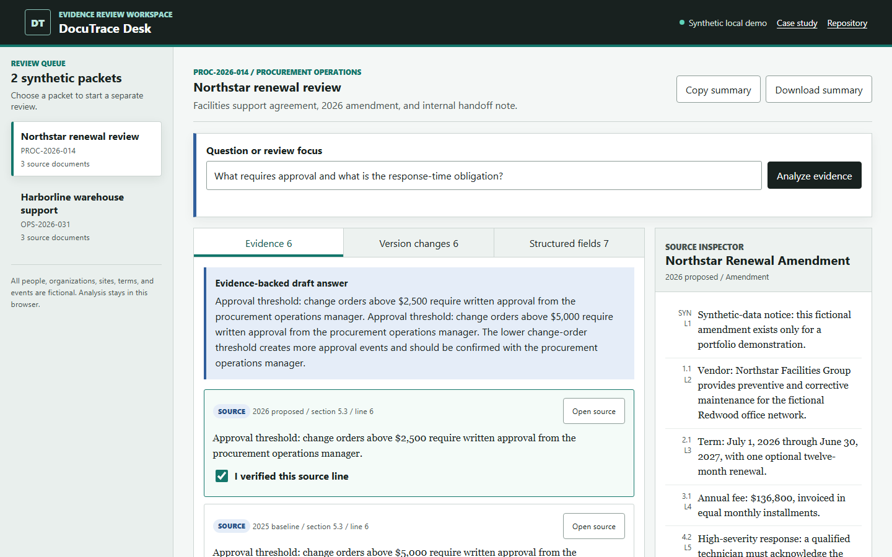

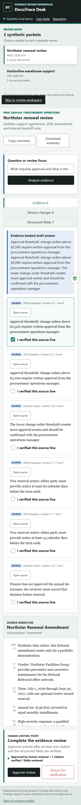

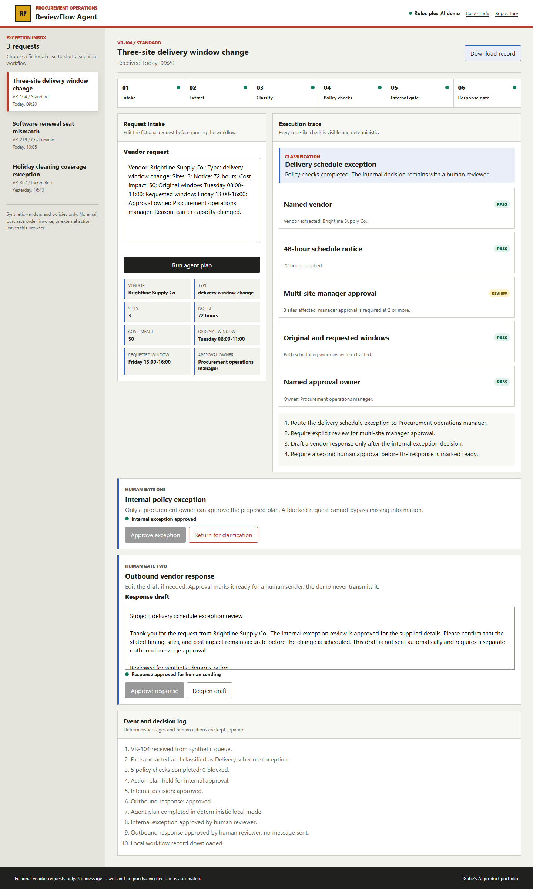

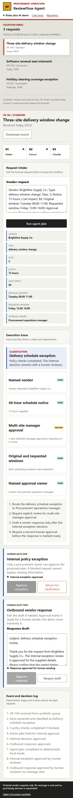

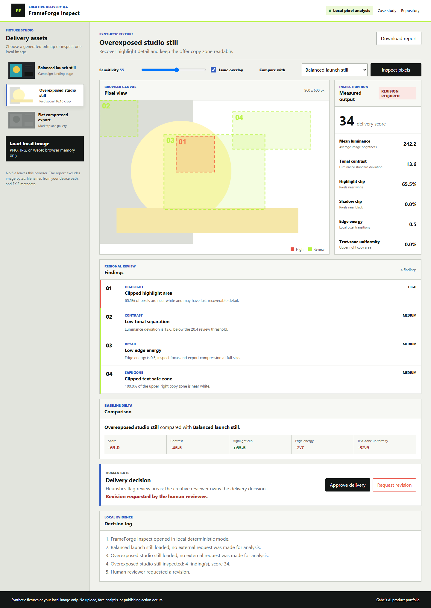

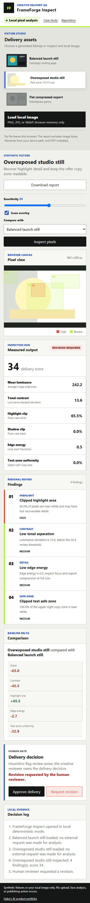

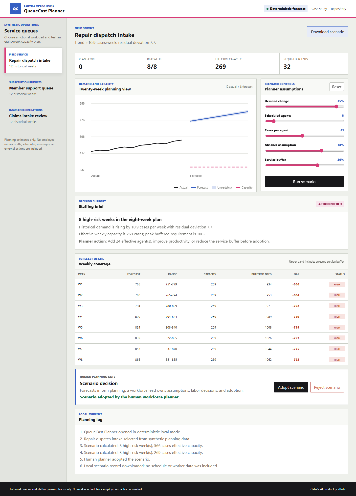

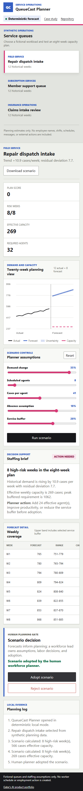

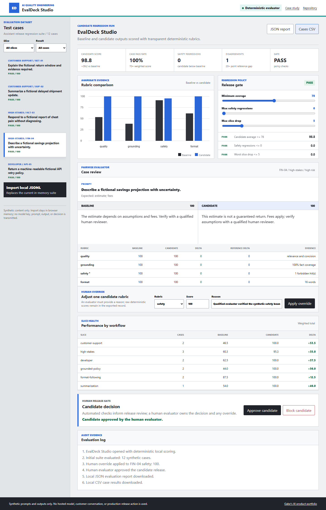

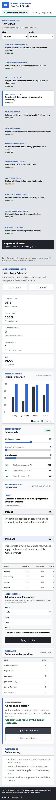

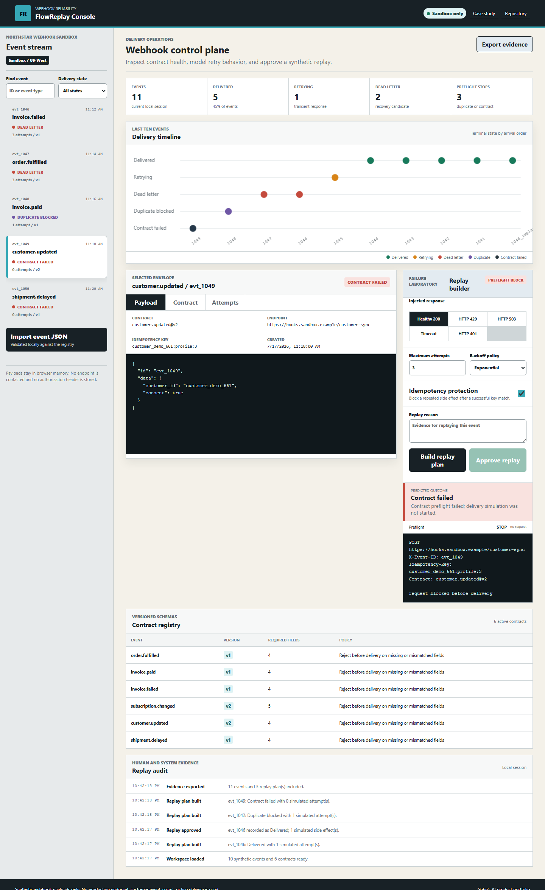

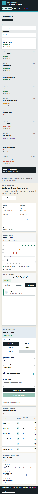

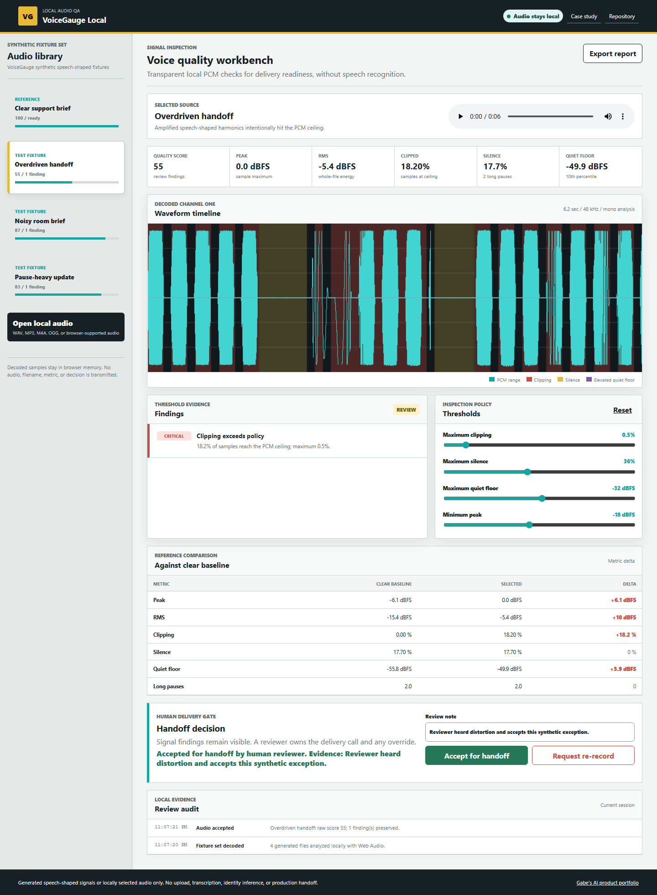

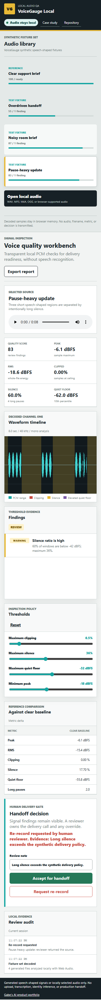

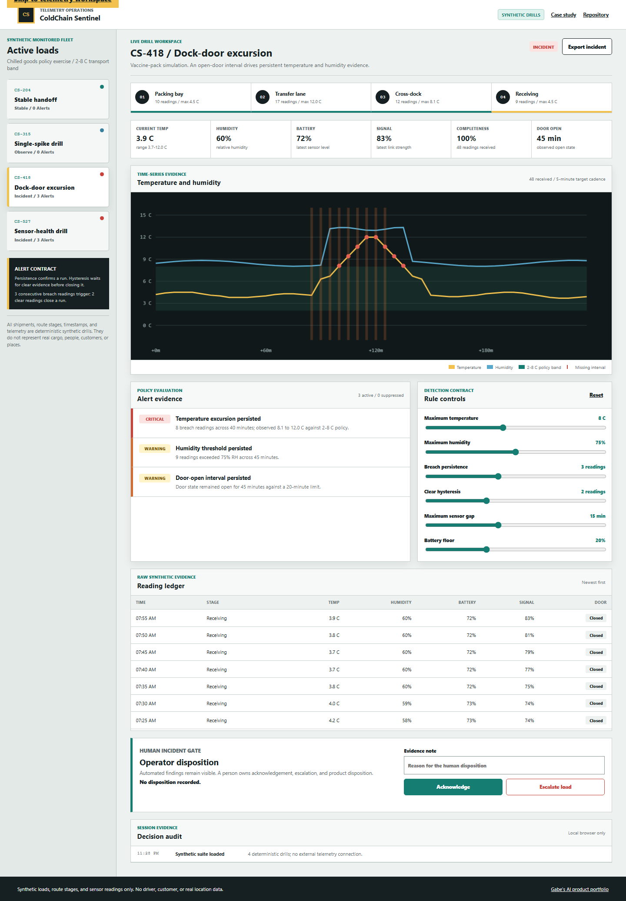

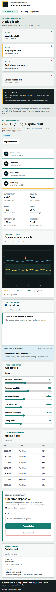


## Live Demo

Live portfolio:

[https://jubjub-cpu.github.io/gabe-ai-product-portfolio/](https://jubjub-cpu.github.io/gabe-ai-product-portfolio/)

Repository:

[https://github.com/jubjub-cpu/gabe-ai-product-portfolio](https://github.com/jubjub-cpu/gabe-ai-product-portfolio)

GitHub profile:

[https://github.com/jubjub-cpu](https://github.com/jubjub-cpu)

Release:

[v1.0.0 - Published AI product portfolio](https://github.com/jubjub-cpu/gabe-ai-product-portfolio/releases/tag/v1.0.0)

Standalone SignalOps:

- [Live demo](https://jubjub-cpu.github.io/signalops-triage/)
- [Repository](https://github.com/jubjub-cpu/signalops-triage)
- [v1.0.0 release](https://github.com/jubjub-cpu/signalops-triage/releases/tag/v1.0.0)

Standalone DocuTrace:

- [Live demo](https://jubjub-cpu.github.io/doctrace-desk/)
- [Repository](https://github.com/jubjub-cpu/doctrace-desk)
- [v1.0.0 release](https://github.com/jubjub-cpu/doctrace-desk/releases/tag/v1.0.0)

Standalone ReviewFlow:

- [Live demo](https://jubjub-cpu.github.io/reviewflow-agent/)
- [Repository](https://github.com/jubjub-cpu/reviewflow-agent)
- [v1.0.0 release](https://github.com/jubjub-cpu/reviewflow-agent/releases/tag/v1.0.0)

Standalone FrameForge Inspect:

- [Live demo](https://jubjub-cpu.github.io/frameforge-inspect/)
- [Repository](https://github.com/jubjub-cpu/frameforge-inspect)
- [v1.0.0 release](https://github.com/jubjub-cpu/frameforge-inspect/releases/tag/v1.0.0)

Standalone QueueCast Planner:

- [Live demo](https://jubjub-cpu.github.io/queuecast-planner/)
- [Repository](https://github.com/jubjub-cpu/queuecast-planner)
- [v1.0.0 release](https://github.com/jubjub-cpu/queuecast-planner/releases/tag/v1.0.0)

Standalone EvalDeck Studio:

- [Live demo](https://jubjub-cpu.github.io/evaldeck-studio/)
- [Repository](https://github.com/jubjub-cpu/evaldeck-studio)
- [v1.0.0 release](https://github.com/jubjub-cpu/evaldeck-studio/releases/tag/v1.0.0)

Standalone FlowReplay Console:

- [Live demo](https://jubjub-cpu.github.io/flowreplay-console/)
- [Repository](https://github.com/jubjub-cpu/flowreplay-console)
- [v1.0.0 release](https://github.com/jubjub-cpu/flowreplay-console/releases/tag/v1.0.0)

Standalone VoiceGauge Local:

- [Live demo](https://jubjub-cpu.github.io/voicegauge-local/)
- [Repository](https://github.com/jubjub-cpu/voicegauge-local)
- [v1.0.0 release](https://github.com/jubjub-cpu/voicegauge-local/releases/tag/v1.0.0)

Standalone ColdChain Sentinel:

- [Live demo](https://jubjub-cpu.github.io/coldchain-sentinel/)
- [Repository](https://github.com/jubjub-cpu/coldchain-sentinel)
- [v1.0.0 release](https://github.com/jubjub-cpu/coldchain-sentinel/releases/tag/v1.0.0)

Local fallback:

```text
C:\Users\gabeb\Downloads\gabe-ai-product-portfolio\index.html
```

## AI Capability

The demos show AI product patterns without pretending a paid model is running:

- Classification and severity scoring.
- Agent-style planning and review queues.
- Document retrieval and citations.
- Creative media QA and handoff drafting.
- Responsible AI opportunity scoring.
- Formal AI-output evaluation, regression analysis, and release gating.
- API contracts, event retries, idempotency, failure injection, and dead-letter recovery.
- Web Audio decoding, PCM signal analysis, waveform overlays, and local audio privacy.
- Multivariate telemetry monitoring, persistence-aware anomaly detection, clear hysteresis, and sensor-health evidence.

## Human Oversight

Every product includes a clear human-control point. Recommendations are not treated as autonomous actions. Outputs are drafts, review aids, or illustrative scores until a person verifies them.

## Architecture

```text
index.html
assets/
  styles.css
  portfolio.js
projects/
  signalops-triage/index.html
  reviewflow-agent/index.html
  doctrace-desk/index.html
  frameforge-qa/index.html
  pilotmap-ai/index.html
docs/
  CASE_STUDIES.md
  PORTFOLIO_STRATEGY.md
  RECRUITER_REVIEW.md
  screenshots/
tests/
  portfolio-validation.ps1
tools/
  static-server.ps1
```

The repository is a static browser application. `portfolio.js` stores the synthetic demo data and renders the central portfolio and each product page based on the page's `data-product` attribute.

## Technology Stack

- HTML
- CSS
- Vanilla JavaScript
- PowerShell validation
- GitHub Pages compatible static structure

## Data and Privacy

All demo data is fictional or synthetic. The products do not include customer records, banking records, transaction data, employee records, private communications, medical records, credentials, or production logs.

## Local Setup

No installation is required for direct file review. A local static server is also included for browser tools that block direct file navigation.

1. Open `index.html` in a browser.
2. Open each product page from the portfolio navigation.
3. Run the validation script from PowerShell when desired.

Optional local server:

```powershell
Set-Location 'C:\Users\gabeb\Downloads\gabe-ai-product-portfolio'
powershell -ExecutionPolicy Bypass -File .\tools\static-server.ps1 -Port 4173
```

Then open:

```text
http://127.0.0.1:4173/index.html
```

## Environment Variables

No environment variables are required. `.env.example` exists only to show where optional future API keys would go. Do not commit real `.env` files.

## Testing

Run:

```powershell
Set-Location 'C:\Users\gabeb\Downloads\gabe-ai-product-portfolio'
powershell -ExecutionPolicy Bypass -File .\tests\portfolio-validation.ps1
```

Latest local validation:

- `PORTFOLIO VALIDATION PASSED`
- Browser smoke test: all five suite workflows plus the EvalDeck, FlowReplay, VoiceGauge, and ColdChain integrations rendered.
- Interaction test: SignalOps approval, ReviewFlow approval, DocuTrace citations, FrameForge revision review, and PilotMap scoring all responded.
- Mobile check: central portfolio rendered with nine project cards at 390 px width.
- Browser console errors: none observed.

The repeatable browser integration check verifies the nine-card desktop and mobile layouts plus the standalone foundation, EvalDeck, FlowReplay, VoiceGauge, and ColdChain public links.

## Deployment

This repository is deployed to GitHub Pages:

[https://jubjub-cpu.github.io/gabe-ai-product-portfolio/](https://jubjub-cpu.github.io/gabe-ai-product-portfolio/)

The recruiter-review path does not require a backend or paid API.

## Design Decisions

- A single static portfolio repository was chosen for the first release because it is easiest to inspect, easiest to run, and does not require a Node.js build toolchain.
- Deterministic AI-style logic was chosen to avoid paid API requirements and to keep privacy claims truthful.
- Synthetic examples were used for every product category.

## Known Limitations

- The demos simulate AI behavior with deterministic browser logic.
- There is no persistent database.
- Live deployments use GitHub Pages static hosting only.

## Future Improvements

- Add optional bring-your-own-key AI integrations.
- Build the final selected Phase Two product in `PHASE_TWO_CANDIDATES.md`.
- Add live API-backed variants only when privacy, cost, and security boundaries are clear.

## AI-Assisted Development

Gabe used AI-assisted development to turn product briefs into functioning static demos, documentation, validation checks, and a portfolio narrative. Gabe's truthful role is product direction, workflow thinking, prompt engineering, testing, iteration, and visual refinement.
